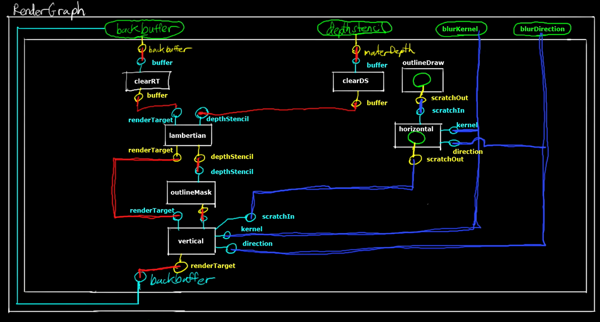

首先什么是**RenderGraphc**？**RenderGraph**的全称为Rendering Dependency Graph（**RDG**），如果我们直接从字面上翻译，它的意思就是**渲染依赖图**。在我们现有的渲染系统中，我们需要把资源（如，顶点、贴图信息）绑定到渲染管线上，然后渲染管线最后在将最后的结果渲染至**渲染对象**（**Render Target**）上。在我们的渲染特效还不是那么多的时候，我们通常只需要一个渲染对象。但是当我们需要多个渲染效果叠加时，一个渲染对象显然就不是那么够用了。

举一个最简单的例子：如果我们想要在控制窗口中选中一个模型的某个节点时，我们想然这个节点控制模型mesh高亮。这时，我们的解决方法是，将模型的信息传入3条不同的渲染路径（Pass），第一条路径将正常渲染模型信息，第二条路径将根据模型的顶点数据绘制mask，第三条路经将忽视模型的全部贴图材质信息，只绘制纯色的模型，但是在mask覆盖的范围内不进行绘制。但是想要实现高亮效果，第三条路径绘制的模型就必须覆盖第一条路径绘制的模型的外轮廓，当然我们可以在第三条路径使用模型的缩放，但是这种方法会因为模型不同遇到各种问题（比如说，缩放圆环会产生很大的问题）。因此最好的方法是对第三条路径的最终渲染结果进行模糊处理，间接使模型的外轮廓放大。这时我们就需要把第三条路径的渲染结果绑定到一个渲染对象上，然后将这个渲染对象作为贴图输入到另一个渲染路径中，进行模糊处理，最后输出到最终渲染对象上。

**渲染依赖图**的使用目的就是为了处理以上情况所描述的复杂过程，它会将不同渲染路径和实现他们渲染效果的资源进行整合，使得路径之间可以共享一些资源，并然一些资源可以在路径之间可以重复使用，不需要实现一个路径创建一次资源