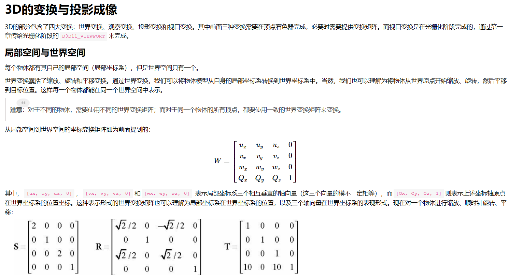
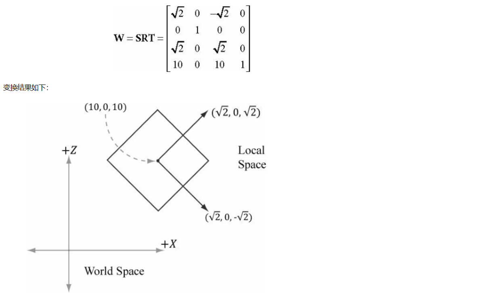
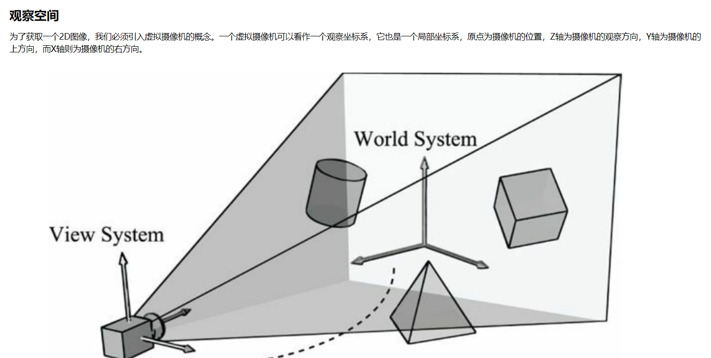
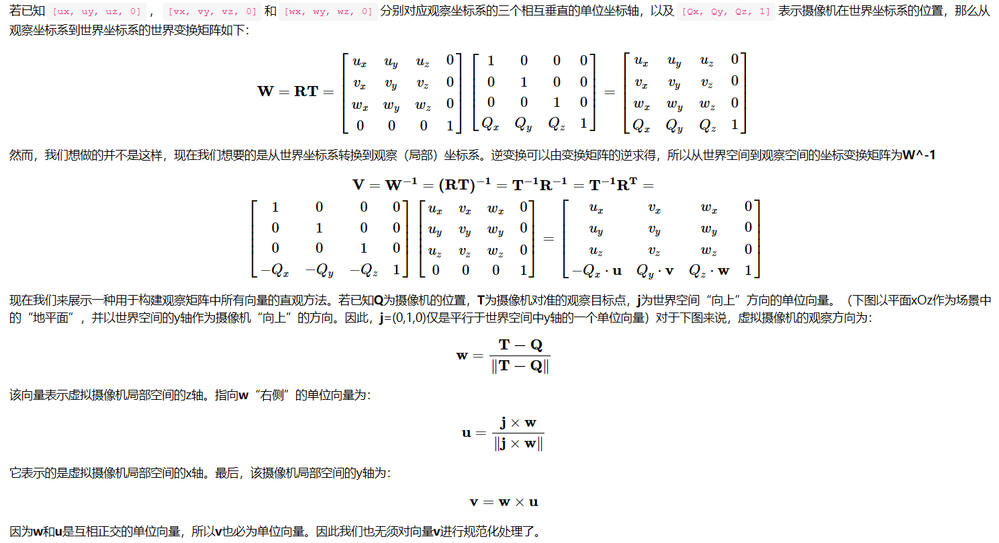

向量

具有方向和大小二重意义的量，在3D世界中可以用v = (x, y, z) 表示顶点和向量

向量点乘

假设有向量
$$
v1 = (x1, y1, z1), v2 = (x2, y2, z2),
$$
 则
$$
v1 · v2 = x1 * x2 + y1 * y2 + z1 * z2
$$
其最终结果得到一个标量。其几何意义在于 
$$
v1 · v2 = |v1| * |v2| * cosθ，
$$
其中θ为v1和v2间的夹角。通常用两个向量的点乘来判断两个向量所成角度是钝角还是锐角

向量叉乘

假设有向量v1，v2，定义如向量点乘所示，则
$$
v1 * v2 = (y1 * z2 - z1 * y2, z1 * x2 - z2 * x1, x1 * y2 - x2 * y1)
$$
向量叉乘的结果是矢量，其几何意义在于向量叉乘的结果是垂直于v1，v2所在平面的向量

顶点

在3D几何空间中，在确定原点和坐标系后，可以用一个向量表示顶点，如p = (x, y, z)。

顶点的变换

位移：

最简单但是可能也是最容易导致问题的变换，设要将顶点从v0 = (x1, y1, z1）移动至 v1 = (x2, y2, z2)，则v1 = v0+ (v1 - v0)

旋转（围绕原点(0, 0, 0)）

但现在暂时先让我们回到一般数学上（右手坐标系）。现在我们需要让向量或坐标点(x, y)绕原点逆时针旋转β度：

我们可以先讨论二位坐标系中归一化向量的情况。设该向量与X轴的夹角为θ，则该向量可以表示为v0 = (cosθ, sinθ) = (x1, y1)，若现在要将其旋转φ角度则新角度可表示为

$$
v1 = (cos(θ + φ), sinθ + φ)) = (cosθcosφ - sinθsinφ, sinθcosφ + sinφcosθ) = (x1cosφ - y1sinφ, y1cosφ + x1sinφ)
$$
按照此方法同时可以扩展到三维坐标系

缩放：
设缩放量为S，则V1 = (Sx1, Sy1, Sz1)

# 矩阵

在计算机中，顶点的位置变化。如旋转，缩放，位移都可以用矩阵来表示，而且用矩阵变化有一个好处，即顶点的所有旋转缩放变换过程可以通过矩阵相乘的方式合并到一个变换矩阵中

### 缩放

缩放（scaling）是指改变物体的大小。通过分别改变x轴、y轴、z轴的比例我们可以得到想要的物体大小，以及宽窄、高低、厚扁程度。

缩放矩阵的表示为：

$$
S = \left[
\matrix{
  S1 & 0 & 0\\
  0 & S2 & 0\\
  0 & 0 &  S3
}
\right]
$$

在DirectXMath中，缩放矩阵对应的函数为`XMMatrixScale`

### 旋转。

这里省略3D空间下分别绕X,Y,Z轴**逆时针旋转**的矩阵推导过程，我们可以得到下面3个对应的矩阵：
$$
Rx =\left[        
\matrix{
  1 & 0 & 0\\
  0 & cosθ & sinθ\\
  0 & -sinθ &  cosθ
}
\right],
Ry = \left[        
\matrix{
  cosθ & 0 & -sinθ\\
  0 &  1 & 0\\
  sinθ & 0 & cosθ
}\right],
Rz = \left[        
\matrix{
  cosθ & sinθ & 0\\
  -sinθ  &  cosθ & 0\\
  0 & 0 & 1
}\right],
$$

需要注意的是，因为左手坐标系跟右手坐标系是镜像关系，因此**右手坐标系**下的绕某一轴**逆时针旋转**（在轴的朝向处向原点看）所用的矩阵，和**左手坐标系**下的绕同一轴**顺时针旋转**（在轴的朝向处向原点看）所用的矩阵是**相同**的。(左手坐标的θ，右手坐标的-θ)

在DirectXMath中，缩放矩阵对应的函数为`XMMatrixRotationX`、`XMMatrixRotationY`、`XMMatrixRotationZ`（参数为弧度）

## 仿射变换

### 齐次坐标

仿射变换是由一个线性变换与一个平移变换组合而成的。对于向量而言，平移操作是没有意义的，因为向量只描述方向与大小、却与位置无关，即平移操作不应作用于向量。因此，平移变换只能应用于点（位置向量）。**齐次坐标（homogeneous coordinate）**所提供的表示机制，使我们可以方便地对点和向量进行统一的处理。在采用其次坐标表示法时，我们将坐标扩充为四元组，第四个坐标w的取值将根据被描述对象是点还是向量而定：

1. **(x, y, z, 0)表示向量**
2. **(x, y, z, 1)表示点**

> 注意：这种表示法可以很方便地表示两个坐标点之差即为一个向量（w分量为0），以及表示一个点与一个向量之和为一个点（w分量为1）

1. **(x, y, z, w)和(x/w, y/w, z/w, 1)都表示同一个点(w≠0)，这对于后续做透视投影会用到这个性质**

### 仿射变换的定义及矩阵表示

线性变换并不能表示出我们需要的所有变换，因此，现将其扩充为一种称作仿射变换的映射范围更广的函数类。仿射变换的矩阵表示法为：
$$
\left[        
\matrix{
x & y & z
}
\right]
\left[        
\matrix{
a11 & a12 & a13 \\
a21 & a22 & a23 \\
a31 & a32 & a33
}
\right] + 
\left[        
\matrix{
t1 & t2 & t3 \\
}
\right] = 
\left[        
\matrix{
x' & y' & z' \\
}
\right]
$$
如果用`w = 1`把坐标扩充为齐次坐标，那么就可以将上式更加简洁地写作：
$$
\left[        
\matrix{
x & y & z & w
}
\right]
\left[        
\matrix{
a11 & a12 & a13 & 0\\
a21 & a22 & a23 & 0\\
a31 & a32 & a33 & 0\\
t1 & t2 & t3 & 1
}
\right] = 
\left[        
\matrix{
x' & y' & z' & w\\
}
\right](w = 1)
$$
假设**S**是一个缩放矩阵，**R**是一个旋转矩阵，**T**是一个平移矩阵。对几何体的变换顺序通常为**先缩放，后旋转，再平移**。对几何体的每个顶点，都有：
$$
((viS)R)T=vi′
$$
因为**矩阵乘法满足结合律**，故可以先计算**SRT**，再计算**vi**与**SRT**的乘积。又或者将**C=SRT**看作一个矩阵，即提前将3种变换封装为一个净变换矩阵。对于一个包含20000顶点组成的3D物体，如果按照上式进行计算，则需要执行60000次的向量与矩阵的乘法运算；而预先将**C**算出来的话，则只需要执行2次矩阵乘法运算和20000次向量与矩阵的乘法运算。

但是，**矩阵乘法并不满足交换律**！这意味着诸如**SR**与**RS**，**RT**与**TR**的变换结果很可能是不同的。

### 平移

现在将平移变换定义为仿射变换。若要利用向量**t**对坐标点**u**进行平移，则这种变换矩阵可以表示为：
$$
T =\left[        
\matrix{
1 & 0 & 0 & 0\\
0 & 1 & 0 & 0\\
0 & 0 & 1 & 0\\
t1 & t2 & t3 & 1
}
\right]
$$

